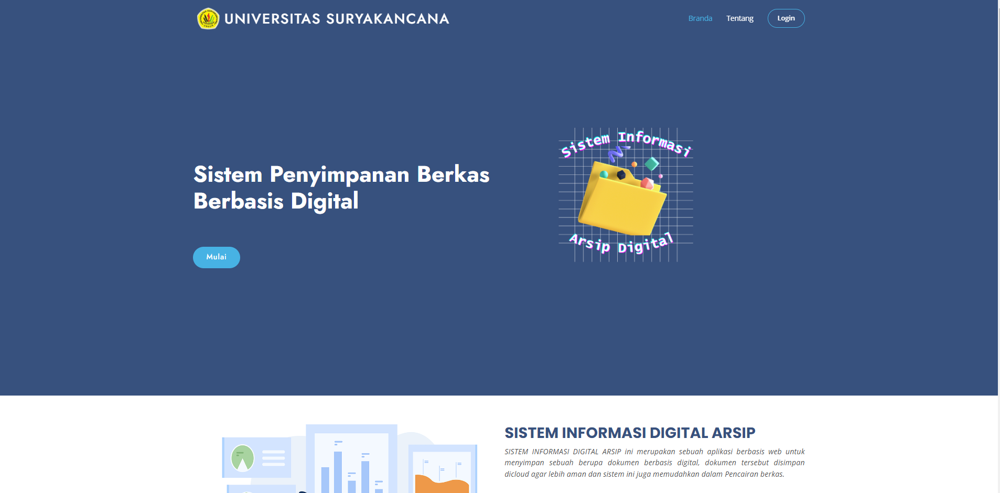
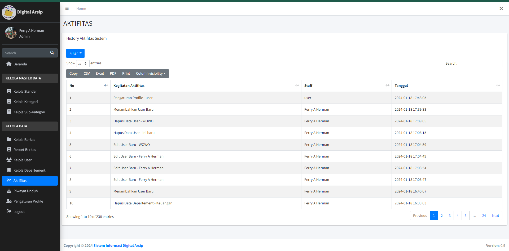

<h1 align="center">Sistem Informasi Digital Arsip</h1> 

_Sebuah Sistem untuk megelola setiap berkas dalam bentuk digital_
_hal ini untuk memudahkan dalam pencarian dan mengurangi kehilangan berkas penting_
_Berikut Beberapa Gambar Webnya :_

## Fitur

- Mengupload Berkas dengan format: PDF, Excel, Word
- Untuk berkas PDF bisa Dipreview sebelum di unduh
- Terintegrasi dengan Google Drive
- Visualisasi Data
- Ada 2 role untuk saat ini
- Tampilan Minimalis
- Dapat Menghandle Ribuan Berkas karena telah menerapkan Server-side (Kecepatan bergantung Spek Server)
- Mencetak Report Laporan
- Ada Log Aktifitas dan juga Riwayat Unduh Berkas

## FOTO Aplikasi

<h3>Logo</h3>

<h3>Tampilan Dashboard</h3>

<h3>Tampilan Kelola Berkas</h3>

<h3>Tampilan Activity</h3>

## Requirements

- PHP >= 8.2 (or higher)
- Composer
- Node.js
- NPM
- MySQL
  Catatan!! Laravel yang digunakan versi : v10.2.1
  (Jika update manual ada kemungkinan terjadi bug dibeberapa fitur)

## Installation
1.  Clone Repository
2.  Run `composer install`
3.  Run `npm install`
4.  Run `npm run dev`
5.  Buat Database lalu update .env bisa juga cp .env.example .env
6.  Run `php artisan key:generate`
7.  Import SQL to Database
8.  Run `php artisan serve`
9. Login dengan akun dibawah
    - Email: `ferryaja@gmail.com`
    - Password: `admin123`
10. Enjoy!
  Catatan!! Import dulu SQL saya belum buat database migration
